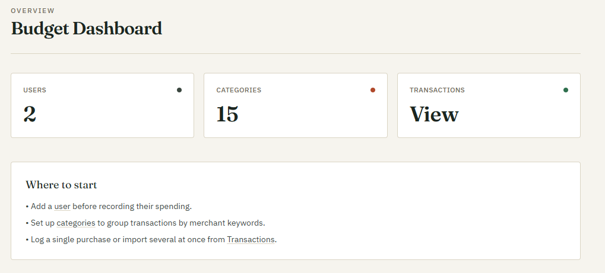
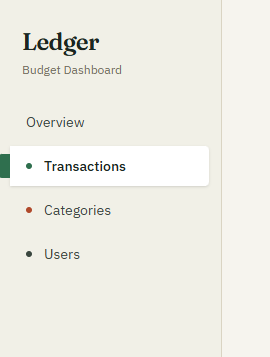
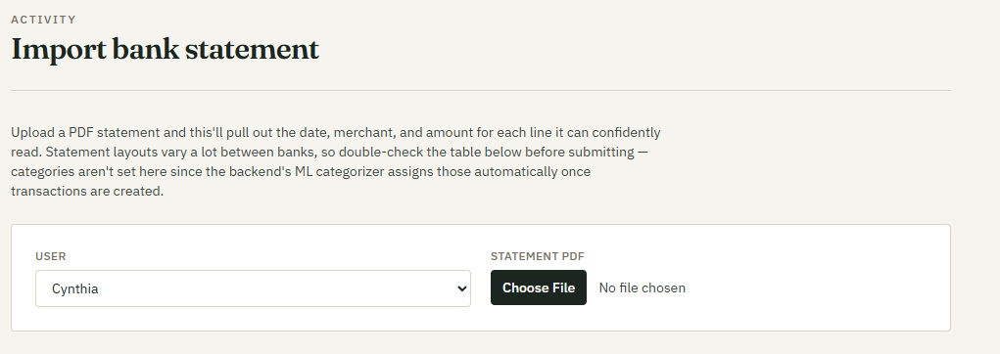
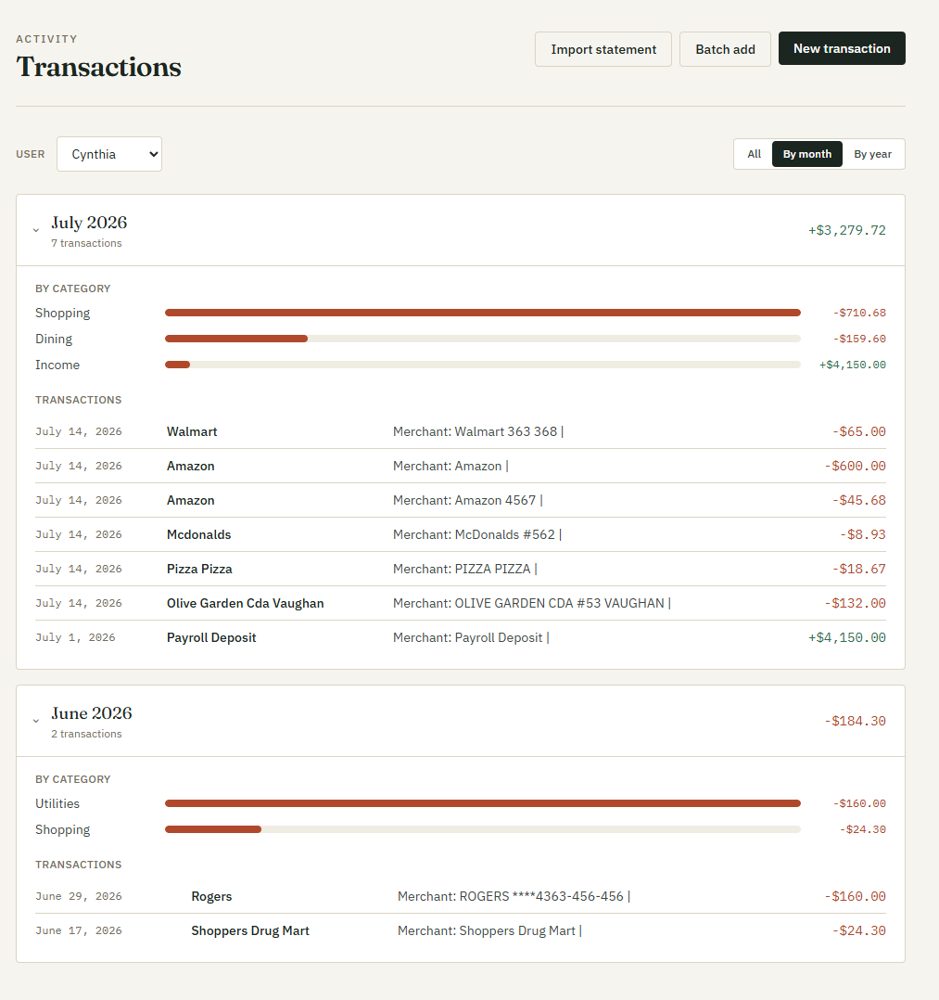
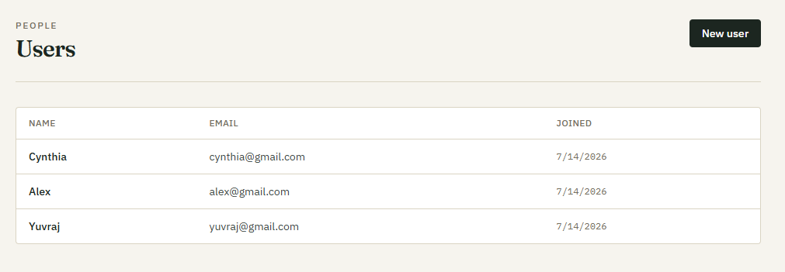

# 💰 BudgetingApp

Smart transaction management with AI-powered automatic categorization. Built with ASP.NET Core, React, and Python ML.

## ✨ Features

- **AI Categorization**: Automatically categorizes transactions using sentence transformer embeddings—just leave category blank
- **Batch Import**: Add multiple transactions at once or import from PDFs
- **Analytics**: Monthly/yearly breakdowns with category spending analysis
- **Multi-user**: Track separate budgets for different users
- **Custom Categories**: Flexible category management with merchant aliasing

## 🚀 Quick Start with Docker (Recommended)

```bash
docker-compose up
```

Then open:

- **Frontend**: http://localhost:5173
- **API Docs**: http://localhost:7103/swagger

The PostgreSQL database, ML service, backend, and frontend all start automatically.

**First-run note**: ML model loads on startup (~1-2 minutes). Services have health checks—wait for all to be healthy before testing.

## Manual Setup (without Docker)

### Prerequisites

- .NET 10 SDK
- Node.js v18+
- Python 3.10+
- PostgreSQL 12+

### 1. Database

```bash
cd BudgetingApp
dotnet ef database update
```

### 2. ML Service (Terminal 1)

```bash
pip install fastapi uvicorn sentence-transformers sqlalchemy psycopg2-binary pydantic
python -m uvicorn run:app --host 0.0.0.0 --port 8000 --reload
```

### 3. Backend API (Terminal 2)

```bash
cd BudgetingApp
dotnet run  # Runs on http://localhost:7103
```

### 4. Frontend (Terminal 3)

```bash
cd dashboard
npm install
npm run dev  # Runs on http://localhost:5173
```

## 📖 Usage

### Navigation




### Add a Transaction


1. Go to **Transactions → New Transaction or Batch add**
2. Enter merchant, amount, date, description
3. **ML automatically predicts category**
4. Save

### Import Bank Statements (in development)



1. Go to **Transactions → Import**
2. Upload PDF from your bank
3. Confirm extracted transactions
4. All auto-categorized

### Update a Transaction


1. Select a transaction to view details
2. Go to **Transactions → Update Transaction**
3. Edit data like category
4. Save **(All matching future transactions will reference the updated category)**

### View Analytics



- Toggle between **All / By Month / By Year** on Transactions page
- See totals and category breakdown for each period
- Expand rows to see individual transactions

### Manage Categories & Users



- Create custom categories and add new users from their respective pages
- Each user has separate transaction history

## 🏗️ Architecture

```
Frontend (React)      Backend (ASP.NET)      ML Service (Python)
  :5173                  :7103                   :8000
    │                      │                        │
    └──────────────────────┼────────────────────────┘
                           │
                        [PostgreSQL]
```

**Flow**: Frontend → Backend → (ML Service for categorization) → PostgreSQL

## 🛠️ Project Structure

```
BudgetingApp/           # ASP.NET Core backend
├── Controllers/        # API endpoints
├── Services/          # Business logic + ML integration
├── Models/            # Database entities
├── DTOs/              # Request/response objects
└── Migrations/        # Database migrations

dashboard/             # React frontend
├── src/api/           # API client modules
├── src/pages/         # Transaction, Category, User pages
├── src/components/    # Reusable UI components
└── src/utils/         # Helpers (grouping, PDF parsing)

merchant_categorizer/  # Python ML service
├── routers/           # API endpoints
└── services/          # Embedding & categorization logic
```

## 📝 Configuration

### Backend (appsettings.Development.json)

```json
{
  "ConnectionStrings": {
    "DefaultConnection": "Server=localhost;Port=5432;Database=budgeting_app;User Id=budgetingapp;Password=budgeting_password;"
  }
}
```

### Docker (auto-configured via docker-compose.yml)

PostgreSQL credentials: `budgetingapp` / `budgeting_password`

## 🔗 API Endpoints

**Swagger UI**: http://localhost:7103/swagger

**Transactions**:

- `GET /api/transaction` – List transactions
- `GET /api/transaction/{id}` – Get transaction by ID
- `GET /api/transaction/{userId}` – Get transactions by User ID
- `POST /api/transaction` – Create transaction
- `POST /api/transaction/batch` – Bulk create
- `PUT /api/transaction/{id}` – Update transaction
- `DELETE /api/transaction/{id}` – Delete transaction

**Categories**:

- `GET /api/category` – List categories
- `GET /api/category/{name}` – Get category ID by name
- `POST /api/category` – Create category

**Users**:

- `GET /api/user` – List users
- `GET /api/user/{id}` – Get user by ID
- `POST /api/user` – Create user
- `DELETE /api/user` – Delete user

**ML (Python service)**:

- `POST /api/v1/predict` – Categorize single merchant
- `POST /api/v1/predict/batch` – Categorize multiple merchants
- `POST /api/v1/cache/invalidate` – Clear category embeddings cache

## 🐛 Troubleshooting

| Issue                              | Solution                                                        |
| ---------------------------------- | --------------------------------------------------------------- |
| Services won't start (Docker)      | Run `docker-compose down -v` then `docker-compose up --build`   |
| ML service slow                    | First startup loads model (~2 min). Subsequent calls are fast.  |
| Port already in use                | Change ports in `docker-compose.yml` or kill the process        |
| Transactions not auto-categorizing | Ensure ML service is running; check `/api/v1/cache/invalidate`  |
| Frontend can't reach backend       | Verify backend running on 7103; check proxy in `vite.config.js` |
